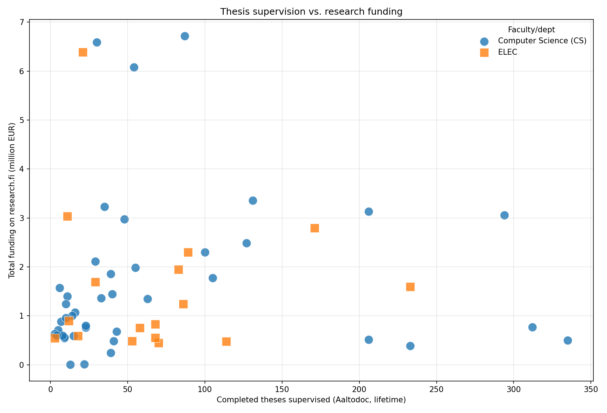

# Thesis supervision vs. research funding

A small, self-contained demo that puts **one anonymous dot per thesis supervisor**
on a single chart:

- **x** — number of master's theses supervised (lifetime, from Aaltodoc)
- **y** — total research funding attributed to that person (their share, € million, from research.fi)

Across ~100 supervisors in two Aalto University departments, supervision volume
and grant income look **largely independent** — the teaching-heavy supervisors
are not the best funded, and vice-versa.



## Data sources (all open)

| Signal | Source | Endpoint |
|---|---|---|
| Theses currently in supervision | Aalto **MyCourses** public supervisor list | `mycourses.aalto.fi/mod/page/view.php?id=1074107` |
| Lifetime completed theses | **Aaltodoc** institutional repository (DSpace 7) | `aaltodoc.aalto.fi/server/api/discover/search/objects` |
| Granted research funding | **research.fi** national research information hub | `researchfi-api-production.2.rahtiapp.fi/portalapi/funding/_search` |

All three are queried live by the script. No API keys required.

## Usage

```bash
python3 aalto_theses_and_funding.py \
    --matched-only \
    --tikz theses_vs_funding.tex \
    --png  theses_vs_funding_anon.png \
    --json theses_vs_funding.json --no-people
pdflatex theses_vs_funding.tex        # -> theses_vs_funding.pdf
```

Useful flags:

- `--x-metric {aaltodoc,current}` — lifetime (default) vs. currently-in-supervision on the x-axis
- `--matched-only` — drop supervisors with no matched funding record (cleaner plot)
- `--include-advisor` — also count Aaltodoc *advisor* (instructor) roles, not just *supervisor*
- `--funding-query TEXT` — restrict the research.fi total (e.g. an organisation)

## Method notes & caveats

- **Everything is anonymised.** Names are used only transiently to run the
  queries; they are never printed, plotted, or written to disk. Every output
  record is `(faculty, theses, grants, funding_eur)`.
- **Name matching handles first-name variants, honestly.** Aaltodoc records the
  same person under many forms — short/long given names (*Alex* / *Alexander*),
  title/affiliation suffixes (`"Kaski, Samuel, Prof., Aalto University…"`),
  spacing and punctuation quirks, and diacritics (*Stéphane* / *Stephane*). For
  each supervisor the script **discovers every given-name form stored for their
  surname**, then merges only the forms that are the *same name truncated*
  (Alex↔Alexander, Chris↔Christopher, Russel↔Russell). It deliberately does
  **not** merge bare initials (*A.* vs *Ari*) or added name components
  (*Jari* vs *Jari-Pekka*), which would inflate the count for a different
  person. Across this dataset ~half the supervisors had at least one variant
  merged. Validated against the self-maintained list at **ml-theses.org**
  (126 completed theses for one supervisor; this method returns 127).
- **Auditability.** Run with `--audit-names PATH` to dump a local,
  non-anonymous CSV of exactly which name forms were merged for each person, so
  any residual false merge is visible. That file is intentionally **not**
  included here (it contains names).
- Remaining limits: non-prefix nicknames (Bob/Robert) are not bridged
  (undercount), and two real people who share a surname and a first-name prefix
  (Alex / Alexandra) can still merge (rare, and surfaced by the audit). Treat
  counts as good estimates, not exact.
- **Funding** is each person's own share (`shareOfFundingInEur`) of every grant
  they appear on, so consortia are not double-counted; cumulative over roughly
  2014–2027 as covered by the research.fi funding dataset.
- Supervisors with **no matched funding record** are omitted from the
  `--matched-only` chart rather than plotted as a misleading €0.

## Files

- `aalto_theses_and_funding.py` — the script (Python 3, standard library + matplotlib for the optional PNG)
- `theses_vs_funding.tex` / `.pdf` — TikZ/pgfplots scatter (anonymous, larger markers)
- `theses_vs_funding_anon.png` — matplotlib preview
- `theses_vs_funding.json` — anonymised per-supervisor data
- `linkedin_theses_vs_funding.md` — a write-up draft
